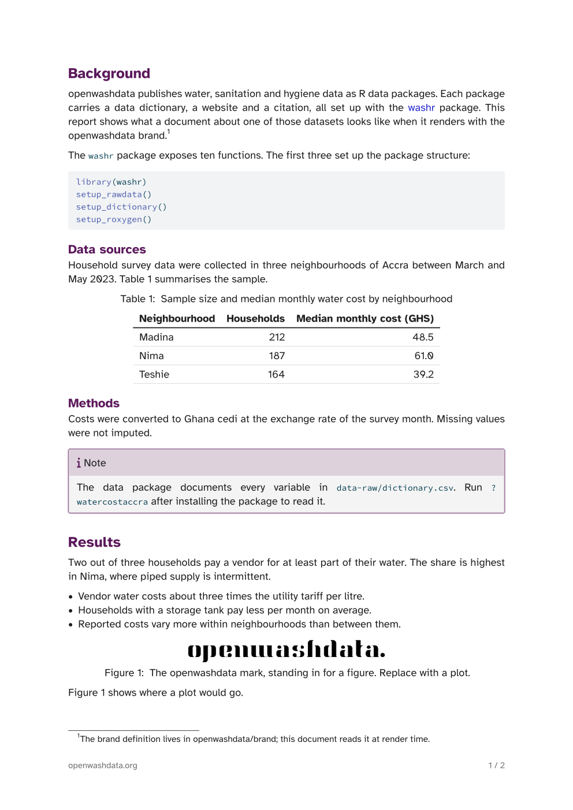

# quarto-owd

A Quarto extension that renders documents in the openwashdata brand. It
provides two formats:

- `owd-typst`: PDF, through Typst
- `owd-docx`: Word

Both take their colours, fonts and logo from the brand definition in
[openwashdata/brand](https://github.com/openwashdata/brand). The Typst
format reads the brand file at render time. The Word format uses a
reference document whose styles are generated from the same file.



## Requirements

- Quarto 1.9 or later. RStudio and Positron bundle it; check with
  `quarto --version`. Quarto 1.8 works too, with one extra line in the
  document header (see [Quarto 1.8](#quarto-18)).
- Nothing else for rendering. R is only needed to regenerate the Word
  reference document (see [Maintaining](#maintaining)).

## Install

For a new document, in an empty directory:

```sh
quarto use template openwashdata/quarto-owd
```

This copies the extension, the brand mirror in `_brand/` and a starter
document named after the directory. Render it with:

```sh
quarto render mydoc.qmd --to owd-typst
```

For an existing project:

```sh
quarto add openwashdata/quarto-owd
quarto use brand openwashdata/brand
```

Then list the formats in the document header:

```yaml
format:
  owd-typst: default
  owd-docx: default
```

## Options

Everything Quarto offers for `typst` and `docx` works as usual, for
example `toc`, `number-sections`, `fontsize`, `papersize` and `margin`.

Both formats put the front matter (title, authors, date, abstract) on a
cover page and start the body on the next page. In the PDF the cover has
no footer and page numbering starts at 1 with the first heading. For a
short memo, keep everything on one page with:

```yaml
cover: false
```

The Typst format adds two more options:

```yaml
format:
  owd-typst:
    footer-text: openwashdata.org   # left side of the footer
    logo-width: 40mm                # width of the logo in the title block
```

## Update

```sh
quarto update openwashdata/quarto-owd
quarto use brand openwashdata/brand
```

The two commands do different things. `quarto use brand` refreshes
`_brand/`, and the Typst format picks the change up at the next render.
The Word styles are baked into the extension's `reference.docx`, so a
brand change reaches Word documents only through `quarto update`, once
this repository has regenerated the file.

## Fonts

The brand uses Atkinson Hyperlegible for text and Source Code Pro for
code.

- Typst: Quarto downloads both from Google Fonts into
  `.quarto/typst/fonts` on the first render. That first render needs a
  network connection.
- Word: the fonts have to be installed on the machine that opens the
  document. Without them Word falls back to Arial and Courier New, which
  the reference document names as alternates. Both brand fonts are free:
  [Atkinson Hyperlegible](https://fonts.google.com/specimen/Atkinson+Hyperlegible)
  and [Source Code Pro](https://fonts.google.com/specimen/Source+Code+Pro).
  Word reads the font list when it starts, so restart it after installing.

## Table of contents

Neither format adds one on its own. Set `toc: true` in the document
header (with `toc-depth` and `toc-title` as usual). The Typst format
computes it at render time and places it on the cover page, after the
abstract; with `cover: false` it opens the body. In Word the table of
contents is a field:
Word asks whether to update fields when the document opens, and answering
Yes fills it in. Otherwise right-click the heading and choose Update
Field.

## Quarto 1.8

Quarto 1.8 does not look for `_brand/` on its own and has no
`quarto use brand` command. Copy `_brand.yml` and `logos/` from
openwashdata/brand into `_brand/` by hand and name the file in the
document header:

```yaml
brand: _brand/_brand.yml
```

## For washr data package authors

After `washr::use_brand()`, a data package already has `_brand.yml` and
`logos/` at its root. In the package root:

```sh
quarto add openwashdata/quarto-owd
```

Do not run `quarto use brand` as well; two brand copies in one project
are one too many. Add `^_extensions$` to `.Rbuildignore`. A `.qmd` in the
package root finds `_brand.yml` on its own with Quarto 1.9; a document in
a subfolder needs `brand: ../_brand.yml` in its header.

## How the brand flows

Values change in openwashdata/brand first. A maintainer then refreshes
the mirror in `_brand/`, regenerates `reference.docx` (see
[Maintaining](#maintaining)) and releases. After that, `quarto update`
brings the Word styles to your project, and `quarto use brand` brings the
brand file itself.

## Maintaining

The Word reference document lives at `_extensions/owd/reference.docx`.
Regenerate its styles from the brand with R (packages xml2, zip, yaml and
brand.yml):

```sh
quarto use brand openwashdata/brand --force
Rscript tools/make-reference-docx.R
```

The script rewrites the styles, theme fonts, font table and page margins
and nothing else, so a header or footer added in Word survives. Running
it twice gives identical bytes. Render `template.qmd` to both formats
once before committing, and commit the regenerated `reference.docx`
together with the refreshed `_brand/`.

`tools/bootstrap-reference-docx.R --force` starts over from pandoc's
default document on A4. It discards any edits made in Word.

## License

MIT for the extension code (see `LICENSE`). The brand definition in
`_brand/` comes from [openwashdata/brand](https://github.com/openwashdata/brand)
under CC BY 4.0; the logos are openwashdata's marks and are included so
that openwashdata material renders with them.
